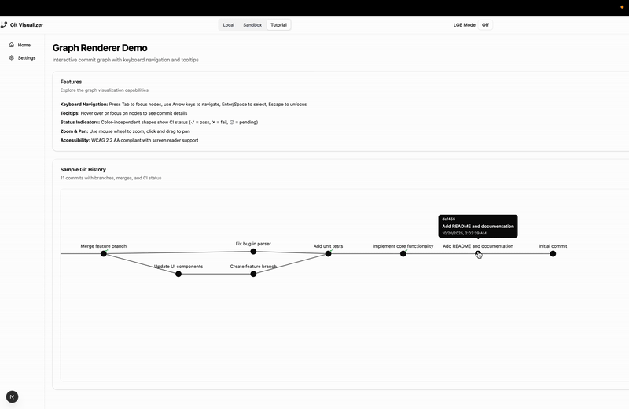

# Git Visualizer
A privacy-first, local-first Git repository visualizer that renders commit graphs as interactive DAGs (Directed Acyclic Graphs). Built with Next.js, React, and ELK layout engine.
<p align="center">
   &nbsp;&nbsp;&nbsp;
</p>
<p align="center">
   &nbsp;&nbsp;&nbsp;
</p>
## Features

- 🔒 **Privacy-First**: All processing happens in your browser - no data leaves your device
- 📁 **Cross-Browser Repository Access**: 
  - Direct folder access via File System Access API (Chrome, Edge)
  - Folder upload fallback for Firefox and Safari
  - ZIP upload as universal fallback for all browsers
- 🎨 **Interactive Visualization**: Pan, zoom, and explore commit graphs with keyboard navigation
- ♿ **Accessible**: WCAG 2.2 AA compliant with keyboard navigation and screen reader support
- ⚡ **Fast Rendering**: Optimized SVG rendering with virtualization for large repositories
- 🎯 **Beginner Friendly**: Clean, intuitive interface for understanding Git history

## LGB Mode

<p align="center">
  
</p>

Git Visualizer includes an optional **LGB (Learn Git Branching) Mode** that recreates the familiar visual style of [Learn Git Branching](https://learngitbranching.js.org/) for educational purposes.

### What is LGB Mode?

LGB Mode provides a **grid-based layout** with smooth animations that help visualize Git operations:

- **Grid Layout**: Commits arranged with generations (topological levels) as rows and branch lanes as columns
- **Animated Operations**: Watch commits, branches, merges, rebases, and cherry-picks unfold with 120-480ms motion windows
- **Visual Grammar**: 
  - Branch labels inline at tips
  - HEAD arrow clearly visible
  - Merge commits show two-parent links
  - Rebase uses dashed "copy" arcs
  - Cherry-pick displays single copy arc

### Accessibility & Performance

**Accessibility (WCAG 2.2 AA):**
- ✅ **Reduced Motion Support**: Automatically collapses animation durations to ≤80ms when `prefers-reduced-motion: reduce` is detected
- ✅ **Screen Reader Announcements**: `aria-live` region announces each Git operation (e.g., "Committed to main", "Rebased 3 commits onto main")
- ✅ **Keyboard Navigation**: Full keyboard access maintained during animations
- ✅ **Color Independence**: All information uses shapes, patterns, and text—not color alone
- ✅ **Zero Critical Violations**: Verified with axe-core in automated tests

**Performance:**
- ⚡ **Smooth 60 FPS**: Animations run at 60 FPS using `requestAnimationFrame`
- 🔒 **Input Locking**: User input disabled during playback to prevent race conditions
- 🎯 **Optimized for Medium Graphs**: First layout ≤1500ms, pan/zoom ≤16ms/frame
- 📊 **Canvas Fallback Ready**: For graphs >10k elements (not yet implemented)

### How to Enable

1. Click the **"LGB Mode"** toggle in the application header
2. Theme applies immediately to all graph visualizations
3. Preference saved in `sessionStorage` for the current session

### Known Limitations

- **Grid Approximation**: ELK's layered algorithm may produce slightly different spacing than original LGB
- **Input Locking**: All user input locked during animation playback (no pausing/scrubbing)
- **Single Scene**: Only one animation at a time; new scenes cancel current ones
- **Browser Support**: Safari <15.4 may not respect `prefers-reduced-motion`

### Learn More

- 📖 **Full Documentation**: See [/docs/LGB_MODE.md](/docs/LGB_MODE.md) for architecture, API, and testing details
- 🎓 **Learn Git Branching**: Visit [learngitbranching.js.org](https://learngitbranching.js.org/) to try the original tool
- 📜 **Attribution**: See [THIRD_PARTY_NOTICES.md](THIRD_PARTY_NOTICES.md) for license information

## Getting Started

### Prerequisites

- Node.js 18+ and pnpm
- Modern browser (Chrome 86+, Edge 86+, Firefox 90+, Safari 15.2+)
- HTTPS connection (recommended for best experience)

### Development

#### Quick Start (Automated)
```bash
# One-command setup and start
./scripts/dev-start.sh
```

#### Manual Setup
```bash
# Install dependencies
pnpm install

# Run validation checks
pnpm validate

# Start development server with HTTPS (recommended)
pnpm dev:https

# Or start regular development server
pnpm dev
```

Open [https://localhost:3000](https://localhost:3000) to view the application.

#### Health Check
```bash
# Verify the application is running correctly
./scripts/health-check.sh
```

#### VS Code Setup
The project includes recommended extensions and settings:
- Install recommended extensions when prompted
- Use built-in debugger configurations
- Automatic formatting and linting on save

📋 See [docs/DEVELOPMENT.md](docs/DEVELOPMENT.md) for the complete development guide.

### Building for Production

```bash
# Build the application
pnpm build

# Start production server
pnpm start
```

## Usage

### Opening a Repository

The application supports three methods for opening Git repositories, automatically selecting the best available option for your browser:

1. **Local Folder (Chrome, Edge)**: Direct access to a local Git repository folder using the File System Access API
2. **Upload Folder (Firefox, Safari)**: Upload all files from a repository folder using directory input
3. **Upload ZIP (All Browsers)**: Upload a ZIP archive of your repository (universal fallback)

**To open a repository:**
1. Click "Open Repository" button
2. Select the appropriate tab based on your browser
3. Choose your repository (folder or ZIP file)
4. The graph will render automatically

**Privacy Guarantee:** All file processing happens entirely in your browser. No data is ever uploaded to any server.

### Interacting with the Graph

1. **Pan & Zoom**: Use mouse to pan/zoom, or keyboard navigation (Tab, Arrow keys)
2. **View Commit Details**: Click on nodes to see commit information
3. **Accessibility**: Full keyboard navigation support with Tab/Shift+Tab

## Architecture

- **Frontend**: Next.js 15 with React 19
- **Layout Engine**: ELK.js for automatic graph layout
- **Rendering**: SVG with React components
- **Git Operations**: isomorphic-git for browser-based Git operations
- **Testing**: Vitest + Playwright for unit and E2E tests

## Browser Support

Git Visualizer supports all modern browsers with automatic fallback for different ingestion methods:

| Browser | Direct Folder Access | Folder Upload | ZIP Upload | Recommended Method |
|---------|---------------------|---------------|------------|-------------------|
| Chrome 86+ | ✅ | ✅ | ✅ | Direct Folder Access |
| Edge 86+ | ✅ | ✅ | ✅ | Direct Folder Access |
| Firefox 90+ | ❌ | ✅ | ✅ | Folder Upload |
| Safari 15.2+ | ❌ | ✅ | ✅ | Folder Upload |

**Notes:**
- **Direct Folder Access** (File System Access API) provides the best experience with read-only access to local folders
- **Folder Upload** uses `webkitdirectory` input for browsers without File System Access API support
- **ZIP Upload** works in all browsers as a universal fallback
- All methods process files entirely in your browser - no data is uploaded

**Performance:**
- Supports repositories up to 500MB with 50,000 files
- ZIP decompression runs in a Web Worker to prevent UI freezing
- Progress indicators show real-time processing status

## Contributing

1. Fork the repository
2. Create a feature branch: `git checkout -b feature/amazing-feature`
3. Commit your changes: `git commit -m 'Add amazing feature'`
4. Push to the branch: `git push origin feature/amazing-feature`
5. Open a Pull Request

### Development Commands

```bash
# Development
pnpm dev              # Start dev server with Turbopack
pnpm dev:https        # Start dev server with HTTPS

# Quality Assurance
pnpm validate         # Run all checks (type, lint, test, build)
pnpm typecheck        # TypeScript type checking
pnpm lint             # ESLint checking
pnpm lint:fix         # Fix auto-fixable lint issues
pnpm test             # Run unit tests
pnpm test:e2e         # Run E2E tests

# Build & Deploy
pnpm build            # Production build
pnpm build:analyze    # Build with bundle analysis
pnpm start            # Start production server

# Maintenance
pnpm clean            # Clear build cache
pnpm reset            # Reset node_modules and reinstall
```

## Deployment

### Vercel (Recommended)

1. Connect your GitHub repository to Vercel
2. Vercel will automatically detect Next.js and configure build settings
3. Deploy with zero configuration

### Static Export

For static hosting (GitHub Pages, Netlify, etc.):

```bash
# Add to next.config.ts
output: 'export'

# Build and export
pnpm build
```

### Environment Variables

No environment variables are required for basic functionality. All Git operations happen locally in the browser.

## Security

- **No Data Exfiltration**: All repository data stays on your device
- **Secure Contexts Only**: Requires HTTPS for File System Access API
- **No External Dependencies**: Works completely offline after initial load
- **Security Headers**: OWASP-recommended headers including CSP, HSTS, and more
- **Content Security Policy**: Strict CSP with local-only connections by default

### Security Testing

You can verify the security posture of this application using [Mozilla Observatory](https://observatory.mozilla.org/):

```bash
# After deploying or running locally
# Visit: https://observatory.mozilla.org/
# Enter your deployment URL (or use ngrok/similar for local testing)
# Observatory will scan and grade your security headers

# Or use the command-line tool:
npm install -g observatory-cli
observatory <your-url>
```

The application implements:
- **Content-Security-Policy**: Restricts resource loading, prevents XSS
- **Strict-Transport-Security**: Enforces HTTPS connections
- **X-Content-Type-Options**: Prevents MIME-sniffing attacks
- **X-Frame-Options**: Prevents clickjacking
- **Referrer-Policy**: Controls referrer information leakage
- **Permissions-Policy**: Disables unnecessary browser features
- **Cross-Origin-Opener-Policy**: Isolates browsing context
- **Cross-Origin-Embedder-Policy**: Requires CORS for cross-origin resources

## Performance

- **Bundle Size**: ~126KB initial load, ~576KB for visualization features
- **Virtualization**: Automatic performance optimization for large repositories
- **Web Workers**: Layout calculations run in background threads (planned)

## Accessibility

- **WCAG 2.2 AA Compliant**: Full accessibility support
- **Keyboard Navigation**: Tab through interface, arrow keys in graph
- **Screen Reader Support**: Proper ARIA labels and semantic markup
- **Color Independence**: Status indicators use shapes, not just colors

## License

MIT License - see [LICENSE](LICENSE) file for details

## Roadmap

- [ ] GitHub/GitLab integration (opt-in overlays)
- [ ] Performance optimizations for very large repositories  
- [ ] Additional visualization modes
- [ ] Export functionality (PNG/SVG)
- [ ] Advanced Git operations support

---

Built with ❤️ for developers who want to understand their Git history without compromising privacy.
