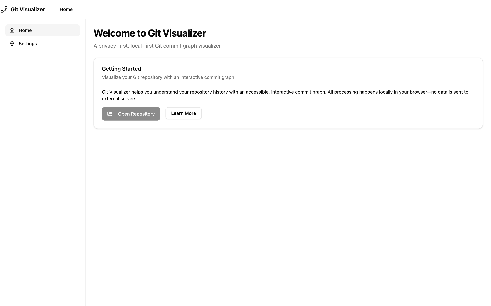

# Git Visualizer
A privacy-first, local-first Git repository visualizer that renders commit graphs as interactive DAGs (Directed Acyclic Graphs). Built with Next.js, React, and ELK layout engine.
<p align="center">
   &nbsp;&nbsp;&nbsp;
</p>
## Features

- 🔒 **Privacy-First**: All processing happens in your browser - no data leaves your device
- 📁 **Local Repository Access**: Uses File System Access API to read local Git repositories
- 🎨 **Interactive Visualization**: Pan, zoom, and explore commit graphs with keyboard navigation
- ♿ **Accessible**: WCAG 2.2 AA compliant with keyboard navigation and screen reader support
- ⚡ **Fast Rendering**: Optimized SVG rendering with virtualization for large repositories
- 🎯 **Beginner Friendly**: Clean, intuitive interface for understanding Git history

## Getting Started

### Prerequisites

- Node.js 18+ and pnpm
- Modern browser with File System Access API support (Chrome 86+, Edge 86+)
- HTTPS connection (required for File System Access API)

### Development

```bash
# Install dependencies
pnpm install

# Start development server with HTTPS
pnpm dev:https

# Or start regular development server
pnpm dev
```

Open [https://localhost:3000](https://localhost:3000) to view the application.

### Building for Production

```bash
# Build the application
pnpm build

# Start production server
pnpm start
```

## Usage

1. **Open a Repository**: Click "Open Repository" and select a local Git folder
2. **Explore the Graph**: Use mouse to pan/zoom, or keyboard navigation (Tab, Arrow keys)
3. **View Commit Details**: Click on nodes to see commit information
4. **Accessibility**: Full keyboard navigation support with Tab/Shift+Tab

## Architecture

- **Frontend**: Next.js 15 with React 19
- **Layout Engine**: ELK.js for automatic graph layout
- **Rendering**: SVG with React components
- **Git Operations**: isomorphic-git for browser-based Git operations
- **Testing**: Vitest + Playwright for unit and E2E tests

## Browser Support

- Chrome 86+ (recommended)
- Edge 86+
- Firefox and Safari have limited support due to File System Access API requirements

## Contributing

1. Fork the repository
2. Create a feature branch: `git checkout -b feature/amazing-feature`
3. Commit your changes: `git commit -m 'Add amazing feature'`
4. Push to the branch: `git push origin feature/amazing-feature`
5. Open a Pull Request

### Development Commands

```bash
# Run tests
pnpm test

# Run E2E tests
pnpm test:e2e

# Lint code
pnpm lint

# Type check
pnpm typecheck
```

## Deployment

### Vercel (Recommended)

1. Connect your GitHub repository to Vercel
2. Vercel will automatically detect Next.js and configure build settings
3. Deploy with zero configuration

### Static Export

For static hosting (GitHub Pages, Netlify, etc.):

```bash
# Add to next.config.ts
output: 'export'

# Build and export
pnpm build
```

### Environment Variables

No environment variables are required for basic functionality. All Git operations happen locally in the browser.

## Security

- **No Data Exfiltration**: All repository data stays on your device
- **Secure Contexts Only**: Requires HTTPS for File System Access API
- **No External Dependencies**: Works completely offline after initial load
- **Security Headers**: OWASP-recommended headers including CSP, HSTS, and more
- **Content Security Policy**: Strict CSP with local-only connections by default

### Security Testing

You can verify the security posture of this application using [Mozilla Observatory](https://observatory.mozilla.org/):

```bash
# After deploying or running locally
# Visit: https://observatory.mozilla.org/
# Enter your deployment URL (or use ngrok/similar for local testing)
# Observatory will scan and grade your security headers

# Or use the command-line tool:
npm install -g observatory-cli
observatory <your-url>
```

The application implements:
- **Content-Security-Policy**: Restricts resource loading, prevents XSS
- **Strict-Transport-Security**: Enforces HTTPS connections
- **X-Content-Type-Options**: Prevents MIME-sniffing attacks
- **X-Frame-Options**: Prevents clickjacking
- **Referrer-Policy**: Controls referrer information leakage
- **Permissions-Policy**: Disables unnecessary browser features
- **Cross-Origin-Opener-Policy**: Isolates browsing context
- **Cross-Origin-Embedder-Policy**: Requires CORS for cross-origin resources

## Performance

- **Bundle Size**: ~126KB initial load, ~576KB for visualization features
- **Virtualization**: Automatic performance optimization for large repositories
- **Web Workers**: Layout calculations run in background threads (planned)

## Accessibility

- **WCAG 2.2 AA Compliant**: Full accessibility support
- **Keyboard Navigation**: Tab through interface, arrow keys in graph
- **Screen Reader Support**: Proper ARIA labels and semantic markup
- **Color Independence**: Status indicators use shapes, not just colors

## License

MIT License - see [LICENSE](LICENSE) file for details

## Roadmap

- [ ] GitHub/GitLab integration (opt-in overlays)
- [ ] Performance optimizations for very large repositories  
- [ ] Additional visualization modes
- [ ] Export functionality (PNG/SVG)
- [ ] Advanced Git operations support

---

Built with ❤️ for developers who want to understand their Git history without compromising privacy.
