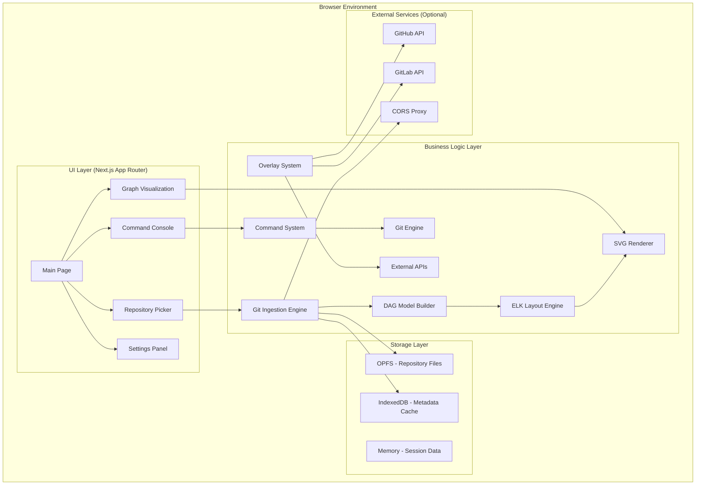
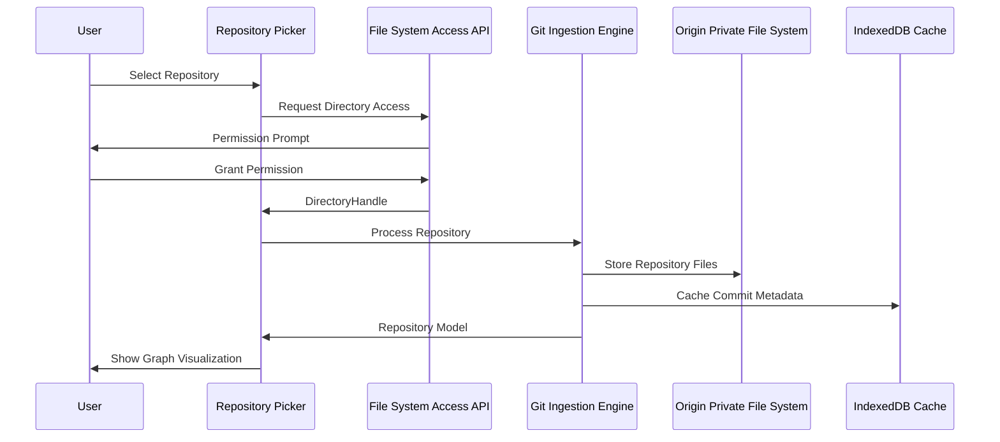
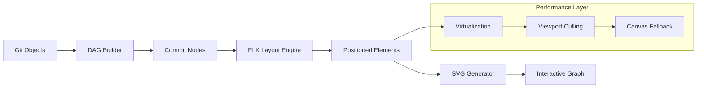
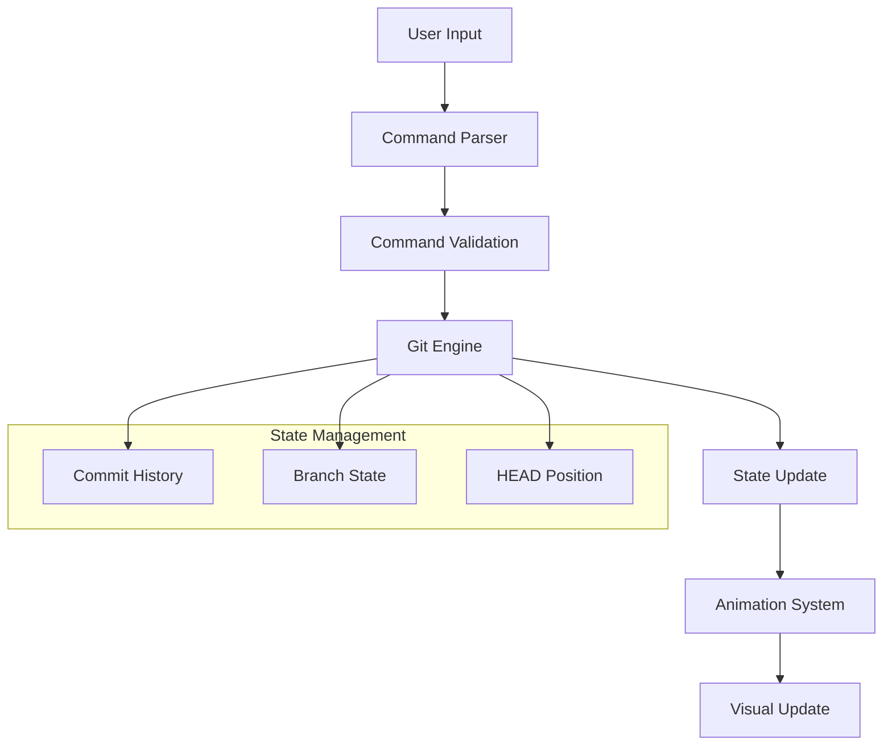
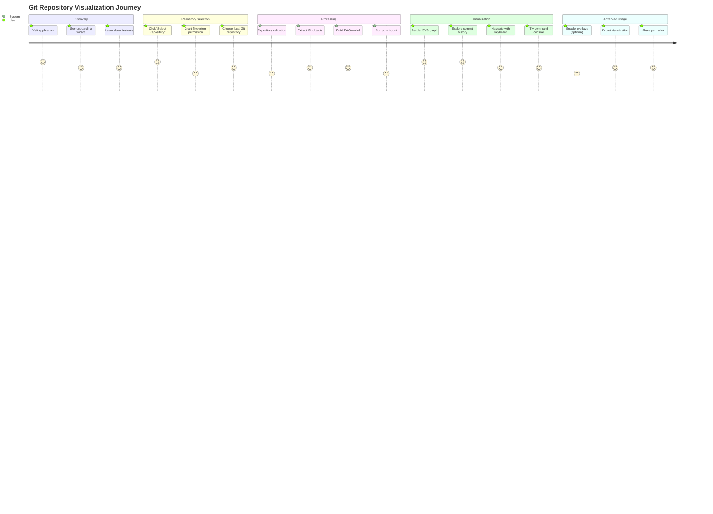
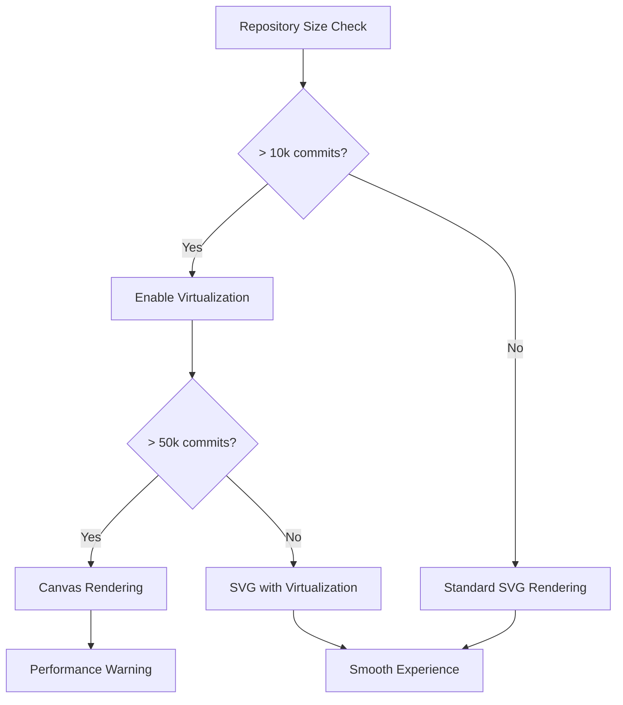

# Git Visualizer - Complete System Architecture & Data Flow Analysis

## Executive Summary

Git Visualizer is a sophisticated **privacy-first, local-first** web application that transforms Git repositories into interactive DAG (Directed Acyclic Graph) visualizations. Built with Next.js 15, React 19, and TypeScript, it provides a comprehensive platform for understanding Git history through visual exploration while maintaining strict privacy controls and WCAG 2.2 AA accessibility standards.

## System Architecture Overview



## Data Flow Architecture

### 1. Repository Ingestion Flow



### 2. Graph Rendering Pipeline



### 3. Command System Architecture



## Component Architecture Deep Dive

### Core Data Structures

```typescript
// Primary Git DAG Model
interface GitCommit {
  id: string;           // SHA hash
  message: string;      // Commit message
  timestamp: number;    // Unix timestamp
  parents: string[];    // Parent commit SHAs
  author: GitAuthor;    // Author information
  refs: string[];       // Branch/tag references
}

interface GitBranch {
  name: string;         // Branch name
  commit: string;       // Current commit SHA
  upstream?: string;    // Upstream branch
  merged?: boolean;     // Merge status
}

interface DagModel {
  commits: Map<string, GitCommit>;
  branches: Map<string, GitBranch>;
  tags: Map<string, string>;      // tag -> commit mapping
  head: HeadState;                // Current HEAD position
}

// Layout Engine Output
interface LayoutNode extends GitCommit {
  x: number;           // Screen X coordinate
  y: number;           // Screen Y coordinate  
  width: number;       // Node width
  height: number;      // Node height
  layer: number;       // ELK layer assignment
}

interface LayoutEdge {
  id: string;          // Unique edge ID
  source: string;      // Source commit SHA
  target: string;      // Target commit SHA
  points: Point[];     // Bezier curve points
}
```

### Module Breakdown

#### 1. Ingestion System (`src/lib/git/`)

**Capabilities Detection** (`capabilities.ts`)
```typescript
interface BrowserCapabilities {
  fileSystemAccess: boolean;     // File System Access API
  opfs: boolean;                 // Origin Private File System
  webWorkers: boolean;           // Web Worker support
  wasm: boolean;                 // WebAssembly support
}
```

**Local Repository Access** (`local.ts`)
- File System Access API integration with permission management
- Directory picker with clear security prompts
- Local `.git` folder parsing via isomorphic-git
- Graceful fallbacks for unsupported browsers

**Remote Repository Access** (`remote.ts`)
- Shallow clone via isomorphic-git + LightningFS
- CORS proxy support for GitHub/GitLab
- OPFS storage for downloaded repositories
- Progressive clone with user feedback

**Privacy Controls**:
- No repository data leaves the browser without explicit consent
- All processing happens client-side
- Session-only storage for sensitive data

#### 2. Layout Engine (`src/viz/elk/`)

**ELK.js Integration** (`layout.ts`)
```typescript
interface LayoutOptions {
  algorithm: 'layered' | 'force' | 'stress';
  nodeSpacing: number;
  layerSpacing: number;
  edgeRouting: 'orthogonal' | 'polyline' | 'splines';
}

interface LayoutResult {
  nodes: LayoutNode[];
  edges: LayoutEdge[];
  bounds: { width: number; height: number };
  duration: number;     // Layout computation time
}
```

**Performance Features**:
- Web Worker-based layout computation (non-blocking)
- Layout caching by repository hash + parameters
- Incremental updates for repository changes
- Configurable performance thresholds

#### 3. Visual Rendering (`src/viz/svg/`)

**SVG Graph Component** (`Graph.tsx`)
```typescript
interface GraphSVGProps {
  nodes: DagNode[];
  edges: Edge[];
  positions: Position;
  onNodeSelect?: (node: DagNode) => void;
  onNodeFocus?: (node: DagNode) => void;
  enableVirtualization?: boolean;
  virtualizationThreshold?: number;
  labelPlacement?: 'right' | 'top';
  skin?: Skin;                  // Visual theme
  animationScene?: AnimScene;   // Animation state
}
```

**Accessibility Features**:
- WCAG 2.2 AA compliant SVG structure
- Keyboard navigation with focus management
- Screen reader support via ARIA labels
- Color-independent status encoding
- High contrast mode support

**Performance Optimizations**:
- Viewport-based virtualization
- Progressive rendering for large graphs
- Canvas/WebGL fallback for >10k elements
- Efficient update strategies

#### 4. Command System (`src/cli/`)

**Command Parser** (`CommandParser.ts`)
```typescript
interface ParsedCommand {
  command: string;        // Primary command
  subcommand?: string;    // Optional subcommand
  args: string[];         // Positional arguments
  options: OptionMap;     // Named options
  flags: string[];        // Boolean flags
}
```

**Git Engine** (`GitEngine.ts`)
- In-memory Git state management
- Core Git operations: commit, branch, checkout, merge, reset
- Detached HEAD support with navigation
- Conflict detection and resolution
- Undo/redo system with history management

**Command Processing Pipeline**:
1. **Parse**: User input → Structured command
2. **Validate**: Command validation + error handling
3. **Execute**: Git operation on in-memory state
4. **Animate**: Visual transition effects
5. **Update**: UI state synchronization

#### 5. Visual Elements System (`src/viz/elements/`)

**Class Hierarchy**:
```typescript
abstract class VisBase {
  id: string;
  element: SVGElement;
  isVisible: boolean;
  
  abstract render(): SVGElement;
  abstract update(data: any): void;
  show(): void;
  hide(): void;
  destroy(): void;
}

class VisNode extends VisBase {
  commit: GitCommit;
  position: Point;
  status?: CIStatus;
  
  render(): SVGGElement;
  updatePosition(x: number, y: number): void;
  setHighlight(enabled: boolean): void;
}

class VisEdge extends VisBase {
  source: string;
  target: string;
  path: string;        // SVG path data
  
  render(): SVGPathElement;
  updatePath(points: Point[]): void;
}
```

**Grid System**:
- `ROW_WIDTH = 80px`, `ROW_HEIGHT = 60px`
- Consistent positioning across all visual elements
- Grid-to-screen coordinate transformation
- Deterministic layout for predictable behavior

#### 6. Performance Guardrails (`src/lib/performance/`)

**Automatic Performance Management**:
```typescript
interface PerformanceThresholds {
  maxVisibleNodes: number;      // 10,000
  maxVisibleEdges: number;      // 15,000
  maxLayoutTime: number;        // 1,500ms
  maxRenderTime: number;        // 16ms (60fps)
}

interface PerformanceMode {
  rendering: 'svg' | 'canvas' | 'webgl';
  virtualization: boolean;
  edgeSimplification: boolean;
  animationReduction: boolean;
}
```

## User Journey Analysis

### Primary User Flow: Repository to Visualization



### Alternative Flows & Edge Cases

#### 1. Cross-Browser Fallback Flow
- **Primary**: File System Access API
- **Fallback 1**: Directory input element
- **Fallback 2**: ZIP file upload
- **Fallback 3**: Sample repository selection

#### 2. Large Repository Handling


## Security & Privacy Architecture

### Data Protection Layers

1. **Client-Side Processing**: All Git operations happen in browser
2. **Permission-Based Access**: File System Access API requires explicit grants
3. **Session-Only Storage**: OAuth tokens never persisted
4. **CORS Proxy Configuration**: Self-hostable for enterprise security
5. **CSP Headers**: XSS protection and resource isolation

### Privacy Controls

```typescript
interface PrivacySettings {
  localOnly: boolean;           // Disable all network requests
  overlaysEnabled: boolean;     // GitHub/GitLab integrations
  analyticsEnabled: boolean;    // Usage analytics (disabled by default)
  cachingEnabled: boolean;      // Local performance caching
}
```

## Performance Characteristics

### Benchmarks (Medium Repository ~5k commits)

| Operation | Target | Typical | Notes |
|-----------|--------|---------|-------|
| Initial Load | ≤ 1500ms | ~800ms | Including layout computation |
| Pan/Zoom | ≤ 16ms | ~8ms | Smooth 60fps interactions |
| Command Execution | ≤ 100ms | ~50ms | Including animation trigger |
| Repository Switch | ≤ 2000ms | ~1200ms | With cache warming |

### Scaling Behavior

| Repository Size | Rendering Mode | Virtualization | Performance |
|----------------|---------------|----------------|-------------|
| < 1k commits | SVG | Disabled | Optimal |
| 1k - 10k commits | SVG | Enabled | Good |
| 10k - 50k commits | Canvas | Enabled | Acceptable |
| > 50k commits | WebGL | Required | With warnings |

## Technology Stack Summary

### Core Framework
- **Next.js 15** with App Router (React Server Components)
- **React 19** with Concurrent Features
- **TypeScript 5** with strict configuration
- **Tailwind CSS 4** with CSS-in-JS optimization

### Visualization Stack
- **ELK.js 0.11** (Eclipse Layout Kernel)
- **isomorphic-git 1.34** (Pure JavaScript Git)
- **@isomorphic-git/lightning-fs** (Browser filesystem)
- **react-zoom-pan-pinch** (Graph interactions)

### Development & Quality
- **Vitest 3.2** (Unit testing)
- **Playwright 1.56** (E2E testing)
- **ESLint 9** with jsx-a11y (Accessibility linting)
- **GitHub Actions** (CI/CD pipeline)

## Future Enhancement Roadmap

### Planned Features
1. **Collaborative Sharing**: Shareable visualization links (metadata only)
2. **Advanced Filtering**: Complex query system for large repositories
3. **Export Capabilities**: SVG, PNG, PDF export with customization
4. **Plugin System**: Custom layout algorithms and visual themes
5. **Mobile Optimization**: Touch-friendly interactions and responsive design

### Technical Debt & Improvements
1. **WebGL Renderer**: For handling extremely large repositories
2. **Streaming Layout**: Progressive layout computation for better UX
3. **Offline Support**: Service Worker for full offline functionality
4. **Advanced Caching**: Smarter cache invalidation and management

This architecture provides a solid foundation for privacy-first Git visualization while maintaining excellent performance, accessibility, and user experience standards.