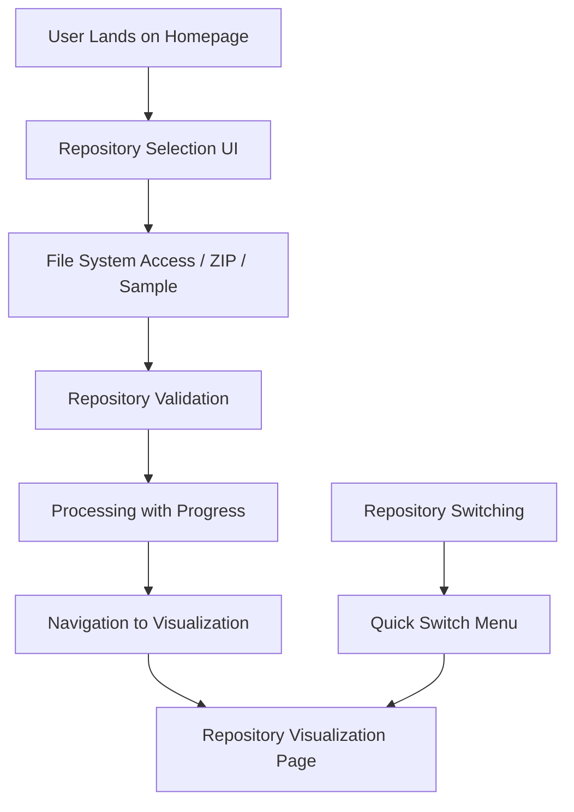

# Issue #3: Enhance Repository Ingestion Flow with Navigation & State Management

## 🎯 **Problem Statement**

The current repository ingestion flow is incomplete - users can select repositories but are not guided to visualization. There's no state management for repository data or navigation between ingestion and visualization phases.

## 📋 **Scope & Deliverables**

### **Primary Deliverable**
- **Complete Ingestion-to-Visualization Flow** with seamless navigation and state management

### **Secondary Deliverables**
- Enhanced repository picker with processing states
- Repository state management system
- Progressive web app features
- Advanced ingestion methods (drag & drop, URL cloning)
- Repository switching interface

## 🏗️ **Technical Implementation Details**

### **1. Enhanced Repository Ingestion Flow**

**Updated Main Page Flow:**


### **2. Repository State Management**

**File:** `src/lib/repository/repository-store.ts`

```typescript
export interface RepositoryStore {
  // Current repository state
  currentRepository: ProcessedRepository | null;
  
  // Repository history/cache
  recentRepositories: RepositoryReference[];
  repositoryCache: Map<string, ProcessedRepository>;
  
  // Loading states
  isLoading: boolean;
  processingProgress: ProcessingProgress | null;
  error: RepositoryError | null;
  
  // Actions
  loadRepository: (source: RepositorySource) => Promise<void>;
  switchRepository: (id: string) => Promise<void>;
  refreshCurrentRepository: () => Promise<void>;
  clearRepository: () => void;
  
  // Cache management
  clearCache: () => void;
  removeFromCache: (id: string) => void;
  getRepositoryFromCache: (id: string) => ProcessedRepository | null;
}

export interface RepositoryReference {
  id: string;
  name: string;
  path?: string; // For local repositories
  url?: string;  // For remote repositories
  lastAccessed: Date;
  metadata: RepositoryMetadata;
  thumbnail?: string; // Base64 encoded preview
}

export interface ProcessingProgress {
  stage: 'validation' | 'parsing' | 'building-dag' | 'optimizing';
  percentage: number;
  message: string;
  timeElapsed: number;
  estimatedTimeRemaining?: number;
}
```

### **3. Enhanced Repository Picker**

**File:** `src/components/ingestion/EnhancedRepositoryPicker.tsx`

```typescript
export interface EnhancedRepositoryPickerProps {
  onRepositoryLoaded: (repository: ProcessedRepository) => void;
  onError: (error: RepositoryError) => void;
  showRecentRepositories?: boolean;
  enableDragDrop?: boolean;
  enableUrlCloning?: boolean;
}

export function EnhancedRepositoryPicker({
  onRepositoryLoaded,
  onError,
  showRecentRepositories = true,
  enableDragDrop = true,
  enableUrlCloning = true
}: EnhancedRepositoryPickerProps) {
  return (
    <div className="space-y-6">
      {/* Primary ingestion methods */}
      <IngestionMethodTabs />
      
      {/* Recent repositories */}
      {showRecentRepositories && <RecentRepositoriesGrid />}
      
      {/* Drag & drop zone */}
      {enableDragDrop && <DragDropZone />}
      
      {/* URL cloning */}
      {enableUrlCloning && <URLCloningForm />}
      
      {/* Processing overlay */}
      <ProcessingOverlay />
    </div>
  );
}
```

### **4. Repository Navigation System**

**File:** `src/components/repository/RepositoryNavigation.tsx`

```typescript
export interface RepositoryNavigationProps {
  currentRepository: ProcessedRepository;
  recentRepositories: RepositoryReference[];
  onRepositorySwitch: (id: string) => void;
  onRepositoryRefresh: () => void;
}

export function RepositoryNavigation({
  currentRepository,
  recentRepositories,
  onRepositorySwitch,
  onRepositoryRefresh
}: RepositoryNavigationProps) {
  return (
    <nav className="repository-navigation">
      {/* Current repository info */}
      <RepositoryBreadcrumb repository={currentRepository} />
      
      {/* Quick switch dropdown */}
      <RepositorySwitcher 
        repositories={recentRepositories}
        onSwitch={onRepositorySwitch}
      />
      
      {/* Actions */}
      <RepositoryActions onRefresh={onRepositoryRefresh} />
    </nav>
  );
}
```

### **5. Progressive Web App Features**

**Service Worker Integration:**
```typescript
// src/lib/repository/repository-cache-sw.ts
export class RepositoryCacheService {
  // Cache processed repositories in IndexedDB
  async cacheRepository(repository: ProcessedRepository): Promise<void>;
  
  // Retrieve cached repository
  async getCachedRepository(id: string): Promise<ProcessedRepository | null>;
  
  // Background repository refresh
  async refreshRepositoryInBackground(id: string): Promise<void>;
  
  // Offline support
  async getOfflineRepositories(): Promise<RepositoryReference[]>;
}
```

## ✅ **Acceptance Criteria**

### **Functional Requirements**
- [ ] **F1:** Seamless flow from repository selection to visualization
- [ ] **F2:** Progress tracking during repository processing
- [ ] **F3:** Repository switching between multiple loaded repositories
- [ ] **F4:** Recent repositories history with thumbnails
- [ ] **F5:** Drag & drop repository folders/ZIP files
- [ ] **F6:** URL-based repository cloning (GitHub/GitLab)
- [ ] **F7:** Offline access to previously loaded repositories
- [ ] **F8:** Repository refresh capability
- [ ] **F9:** Error recovery with user-friendly messages
- [ ] **F10:** Deep linking to specific repositories

### **Performance Requirements**
- [ ] **P1:** Repository switching <500ms for cached repositories
- [ ] **P2:** Processing progress updates every 100ms
- [ ] **P3:** Repository cache limit of 50MB total
- [ ] **P4:** Background repository refresh without UI blocking
- [ ] **P5:** Instant access to recent repositories list

### **User Experience Requirements**
- [ ] **UX1:** Clear visual feedback during all processing stages
- [ ] **UX2:** Intuitive repository switching interface
- [ ] **UX3:** One-click access to recent repositories
- [ ] **UX4:** Drag & drop visual feedback
- [ ] **UX5:** Contextual help for each ingestion method

## 🧪 **Testing Requirements**

### **Unit Tests**
```typescript
// src/lib/repository/__tests__/repository-store.test.ts
describe('RepositoryStore', () => {
  test('loads repository with progress tracking');
  test('caches repository data correctly');
  test('switches between repositories');
  test('handles repository refresh');
  test('manages repository cache limits');
  test('persists repository references');
  
  test('handles concurrent repository loads');
  test('recovers from processing errors');
  test('validates repository sources');
});

// src/components/ingestion/__tests__/enhanced-repository-picker.test.ts
describe('EnhancedRepositoryPicker', () => {
  test('displays all ingestion methods');
  test('handles drag & drop operations');
  test('processes URL cloning');
  test('shows recent repositories');
  test('displays processing progress');
  test('handles ingestion errors gracefully');
});
```

### **Integration Tests**
```typescript
// e2e/repository-ingestion-flow.spec.ts
describe('Repository Ingestion Flow', () => {
  test('complete flow: select → process → navigate → visualize');
  test('repository switching between multiple repositories');
  test('drag & drop repository ingestion');
  test('URL cloning with authentication');
  test('offline repository access');
  test('repository refresh functionality');
  test('error recovery and retry mechanisms');
});
```

### **Performance Tests**
```typescript
describe('Repository Ingestion Performance', () => {
  test('repository switching under 500ms');
  test('progress updates frequency');
  test('cache memory usage limits');
  test('concurrent repository processing');
  test('background refresh performance');
});
```

## 🌐 **Cross-Browser Compatibility**

### **Feature Support Matrix**
| Feature | Chrome 86+ | Edge 86+ | Firefox | Safari |
|---------|------------|----------|---------|--------|
| File System Access | ✅ Native | ✅ Native | ⚠️ Fallback | ⚠️ Fallback |
| Drag & Drop | ✅ Full | ✅ Full | ✅ Full | ✅ Limited |
| URL Cloning | ✅ Full | ✅ Full | ✅ Full | ✅ Full |
| IndexedDB Cache | ✅ Full | ✅ Full | ✅ Full | ✅ Full |
| Service Worker | ✅ Full | ✅ Full | ✅ Full | ✅ Full |

### **E2E Testing Strategy**
```typescript
const crossBrowserTests = [
  {
    browser: 'chromium',
    features: ['file-system-access', 'drag-drop', 'url-cloning', 'caching']
  },
  {
    browser: 'firefox', 
    features: ['directory-input', 'drag-drop', 'url-cloning', 'caching']
  },
  {
    browser: 'webkit',
    features: ['zip-upload', 'limited-drag-drop', 'url-cloning', 'caching']
  }
];
```

## 📦 **Bundle & Performance Budgets**

### **Bundle Size Impact**
- **Repository store:** <30KB gzipped
- **Enhanced picker:** <50KB gzipped
- **URL cloning:** <40KB gzipped (dynamic import)
- **Service worker:** <20KB gzipped
- **Total impact:** <140KB additional

### **Runtime Performance Budget**
- **Repository switching:** <500ms
- **Cache operations:** <100ms
- **Progress updates:** 60fps (16ms intervals)
- **Background operations:** Non-blocking UI
- **Memory usage:** <50MB for repository cache

## ♿ **Accessibility Requirements**

### **WCAG 2.2 AA Compliance**
- [ ] **Drag & Drop Alternative:** Keyboard-accessible file selection
- [ ] **Progress Indicators:** Screen reader announcements
- [ ] **Error States:** Clear error messages with recovery actions
- [ ] **Repository Switching:** Keyboard navigation support
- [ ] **Focus Management:** Proper focus during state transitions

### **Accessibility Features**
```typescript
interface A11yIngestionFeatures {
  keyboardNavigation: {
    repositorySwitching: boolean;
    ingestionMethods: boolean;
    dragDropAlternative: boolean;
  };
  screenReaderSupport: {
    progressAnnouncements: boolean;
    errorAnnouncements: boolean;
    stateChanges: boolean;
  };
  visualAccessibility: {
    highContrastProgress: boolean;
    reducedMotionProgress: boolean;
    focusIndicators: boolean;
  };
}
```

## 🔧 **CI/CD Integration**

### **Quality Gates**
```yaml
# .github/workflows/repository-ingestion.yml
repository-ingestion-tests:
  steps:
    - name: Unit Tests
      run: pnpm test:unit src/lib/repository/ --coverage=90
    
    - name: Integration Tests
      run: pnpm test:integration --timeout=30000
    
    - name: E2E Cross-Browser Tests
      run: pnpm test:e2e --browsers=all --parallel
    
    - name: Performance Tests
      run: pnpm test:performance --ingestion-budget
    
    - name: A11y Tests
      run: pnpm test:a11y --ingestion-flows
    
    - name: Security Tests
      run: pnpm test:security --url-cloning --file-upload
```

### **Performance Monitoring**
- **Repository processing time** tracking
- **Cache hit/miss ratio** monitoring  
- **Error rate tracking** by ingestion method
- **User flow completion rate** analytics

## 📚 **Documentation Requirements**

### **User Documentation**
- [ ] **Repository Ingestion Guide** (`docs/user-guides/repository-ingestion.md`)
- [ ] **Drag & Drop Tutorial** (`docs/user-guides/drag-and-drop.md`)  
- [ ] **URL Cloning Guide** (`docs/user-guides/url-cloning.md`)
- [ ] **Repository Management** (`docs/user-guides/repository-management.md`)

### **Developer Documentation**
- [ ] **Repository Store Architecture** (`docs/implementation/core/repository-store.md`)
- [ ] **Ingestion Flow Design** (`docs/implementation/features/ingestion-flow.md`)
- [ ] **Caching Strategy** (`docs/implementation/performance/repository-caching.md`)

### **API Documentation**
```typescript
/**
 * Enhanced Repository Picker Component
 * 
 * Provides multiple methods for repository ingestion with progress
 * tracking, caching, and seamless navigation to visualization.
 * 
 * @example
 * ```tsx
 * <EnhancedRepositoryPicker
 *   onRepositoryLoaded={(repo) => navigate('/repo')}
 *   showRecentRepositories={true}
 *   enableDragDrop={true}
 * />
 * ```
 */
```

## 🔗 **Implementation References**

### **State Management**
- [Zustand Documentation](https://github.com/pmndrs/zustand)
- [React Query for Caching](https://tanstack.com/query/latest)
- [IndexedDB Best Practices](https://developer.mozilla.org/en-US/docs/Web/API/IndexedDB_API)

### **Progressive Web Apps**
- [Service Worker Guide](https://developer.mozilla.org/en-US/docs/Web/API/Service_Worker_API)
- [Cache API](https://developer.mozilla.org/en-US/docs/Web/API/Cache)
- [Background Sync](https://developer.mozilla.org/en-US/docs/Web/API/Background_Sync_API)

### **File Handling**
- [Drag and Drop API](https://developer.mozilla.org/en-US/docs/Web/API/HTML_Drag_and_Drop_API)
- [File API](https://developer.mozilla.org/en-US/docs/Web/API/File)
- [URL API for Cloning](https://developer.mozilla.org/en-US/docs/Web/API/URL)

## 🔐 **Security Considerations**

### **URL Cloning Security**
- **HTTPS enforcement** for all remote repositories
- **CORS proxy validation** and allowlist
- **Input sanitization** for repository URLs
- **Rate limiting** for cloning operations
- **Authentication token security** (memory-only storage)

### **File Upload Security**
- **File type validation** (ZIP, Git directories only)
- **Size limits** (configurable, default 100MB)
- **Content scanning** for malicious files
- **Sandboxed processing** of uploaded content

## 🎯 **Definition of Done**

- [ ] All functional requirements implemented and tested
- [ ] Cross-browser compatibility verified
- [ ] Performance budgets met
- [ ] Security review completed
- [ ] A11y compliance verified (100% automated score)
- [ ] Documentation complete
- [ ] E2E tests passing across all browsers
- [ ] Performance tests within budget
- [ ] Feature flags configured
- [ ] Analytics events implemented

## 🔄 **Dependencies & Blockers**

### **Depends On:**
- **Issue #1:** Git Repository Processor (hard dependency)
- Repository Context Provider
- Basic visualization components

### **Enables:**
- **Issue #2:** Repository Visualization Page
- Advanced repository management features
- Collaborative repository sharing

## 📊 **Success Metrics**

### **User Engagement**
- **Completion Rate:** >85% users complete ingestion flow
- **Repository Switching:** >50% users access multiple repositories
- **Method Adoption:** Drag & drop >30%, URL cloning >20%
- **Return Usage:** >60% users return to recent repositories

### **Technical Performance**
- **Processing Success Rate:** >98% for valid repositories
- **Cache Hit Rate:** >70% for repository switching
- **Error Recovery Rate:** >90% users recover from errors
- **Cross-browser Parity:** >95% feature consistency

### **Quality Metrics**
- **Bug Rate:** <2 critical bugs per month
- **Performance Regression:** <5% month-over-month
- **Accessibility Score:** 100% automated compliance
- **Security Issues:** 0 critical vulnerabilities

## 🚀 **Rollout Strategy**

### **Phase 1: Core Flow (Week 1-2)**
- Basic ingestion → visualization navigation
- Repository state management
- Progress tracking

### **Phase 2: Enhanced Features (Week 3-4)**
- Recent repositories
- Repository switching
- Drag & drop support

### **Phase 3: Advanced Features (Week 5-6)**
- URL cloning
- Offline support
- Background refresh

### **Phase 4: Optimization (Week 7-8)**
- Performance tuning
- Cache optimization
- User experience polish