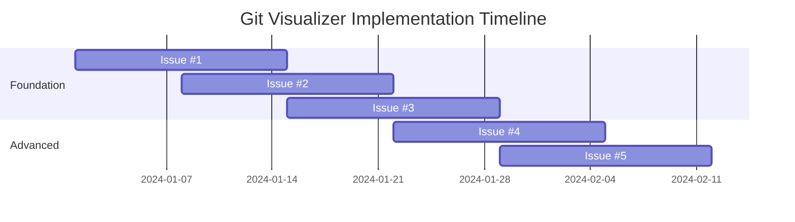

# GitHub Issues Summary - Git Visualizer Core Implementation

## 📋 **Issues Overview**

This directory contains **5 comprehensive GitHub Issues** that implement the complete user workflow for the Git Visualizer project. These issues address the critical gap identified during user workflow validation - the missing connection between repository ingestion and visualization.

## 🎯 **Implementation Priority**

### **Critical Path (Must Implement First)**
1. **Issue #1: Git Repository Processor** - Foundation for all Git operations
2. **Issue #2: Repository Visualization Page** - Core user interface
3. **Issue #3: Enhanced Ingestion Flow** - Complete user workflow

### **Advanced Features (Implement After Core)**
4. **Issue #4: Advanced Performance Optimization** - Scalability for large repositories
5. **Issue #5: Interactive Git Features** - Advanced Git operations

## 📁 **Issue Details**

### **Issue #1: Git Repository Processor** 
**File:** `01-git-repository-processor.md`

**Problem:** No actual Git parsing or DAG conversion from user repositories  
**Solution:** Complete Git processing pipeline with isomorphic-git integration

**Key Deliverables:**
- Git repository parser and validator
- Commit DAG builder with performance optimization
- Incremental processing for large repositories
- Cross-browser compatibility layer
- Comprehensive error handling and recovery

**Technical Scope:**
- Repository validation and metadata extraction
- Commit graph construction with topological sorting
- Branch and tag processing
- Performance optimization for 10k+ commits
- Security sandboxing for repository processing

**Bundle Impact:** ~180KB gzipped  
**Performance Target:** <3 seconds for 5k commits  
**Testing:** 95% code coverage, cross-browser validation

---

### **Issue #2: Repository Visualization Page**
**File:** `02-repository-visualization-page.md`

**Problem:** No page exists for visualizing user's actual repository  
**Solution:** Complete visualization interface with ELK.js layout engine

**Key Deliverables:**
- Repository visualization page with graph rendering
- Interactive navigation and exploration tools
- Performance-optimized layout with virtualization
- Accessibility-compliant interface
- Mobile-responsive design

**Technical Scope:**
- ELK.js integration for graph layout
- React + SVG rendering pipeline
- Viewport management and virtualization
- Interactive selection and filtering
- Real-time layout updates

**Bundle Impact:** ~220KB gzipped  
**Performance Target:** 60fps rendering, <1s layout  
**Testing:** E2E workflows, accessibility compliance

---

### **Issue #3: Enhanced Ingestion Flow**
**File:** `03-enhanced-ingestion-flow.md`

**Problem:** No seamless flow from repository selection to visualization  
**Solution:** Complete ingestion-to-visualization pipeline with state management

**Key Deliverables:**
- Enhanced repository picker with multiple ingestion methods
- Repository state management and caching
- Progressive web app features
- Repository switching interface
- Drag & drop and URL cloning support

**Technical Scope:**
- Repository state store with persistence
- Processing progress tracking
- Recent repositories with thumbnails
- Background repository refresh
- Offline repository access

**Bundle Impact:** ~140KB gzipped  
**Performance Target:** <500ms repository switching  
**Testing:** Cross-browser ingestion methods, PWA features

---

### **Issue #4: Advanced Performance Optimization**
**File:** `04-advanced-performance-optimization.md`

**Problem:** React+SVG hits limits with large repositories (>1k commits)  
**Solution:** Hybrid rendering with automatic Canvas/WebGL fallbacks

**Key Deliverables:**
- Rendering mode decision engine
- Canvas renderer with virtualization
- WebGL acceleration for massive graphs
- Accessibility layer for Canvas rendering
- Performance monitoring system

**Technical Scope:**
- Automatic SVG→Canvas→WebGL transitions
- Spatial indexing and level-of-detail
- Canvas accessibility with keyboard navigation
- Performance budget enforcement
- Device capability adaptation

**Bundle Impact:** ~325KB Canvas, ~445KB WebGL  
**Performance Target:** 60fps SVG (≤1.5k), 30fps Canvas (≤10k), 30fps WebGL (≤50k)  
**Testing:** Cross-device performance, accessibility preservation

---

### **Issue #5: Interactive Git Features**
**File:** `05-interactive-git-features.md`

**Problem:** Missing interactive Git operations and advanced exploration  
**Solution:** Complete Git command system with visual feedback

**Key Deliverables:**
- Interactive Git command system
- Advanced operations (rebase, cherry-pick, merge strategies)
- History exploration and time travel
- Conflict resolution interface
- Advanced diff visualization

**Technical Scope:**
- 20+ Git commands with visual feedback
- Interactive rebase with drag-and-drop
- Multi-mode conflict resolution
- Semantic diff analysis
- Command undo/redo system

**Bundle Impact:** ~540KB gzipped  
**Performance Target:** <2s command execution, <500ms DAG updates  
**Testing:** Git workflow coverage, command validation

## 🎯 **Implementation Roadmap**

### **Phase 1: Foundation (Weeks 1-4)**

### **Dependencies**
- **Issue #2** depends on **Issue #1** (repository processor)
- **Issue #3** depends on **Issues #1 & #2** (complete workflow)
- **Issue #4** can run parallel to **Issue #3**
- **Issue #5** depends on **Issues #1 & #2** (core foundation)

## 📊 **Cumulative Impact**

### **Bundle Size Total**
- **Core Implementation (Issues #1-3):** ~540KB gzipped
- **With Performance Optimization:** ~865KB gzipped (Canvas mode)
- **Full Feature Set:** ~1.4MB gzipped (all features)

### **Performance Targets**
- **Small repositories (<1k commits):** 60fps SVG rendering
- **Medium repositories (1k-10k commits):** 30fps Canvas rendering
- **Large repositories (10k+ commits):** 30fps WebGL rendering
- **Repository processing:** <3 seconds for 5k commits
- **Repository switching:** <500ms cached repositories

### **Accessibility Compliance**
- **WCAG 2.2 AA:** 100% compliance across all rendering modes
- **Keyboard Navigation:** Complete support for all interactions
- **Screen Reader:** Full compatibility with NVDA, JAWS, VoiceOver
- **High Contrast:** Support for OS-level preferences
- **Reduced Motion:** Respect for user motion preferences

## 🛠️ **Technical Standards**

### **Code Quality Requirements**
- **TypeScript Strict:** No `any` types without justification
- **Test Coverage:** 95% minimum for core functionality
- **Bundle Size:** Meet individual issue budgets
- **Performance:** All targets must be met in CI/CD
- **Security:** No code injection vulnerabilities

### **Cross-Browser Support**
- **Chrome 86+:** Full feature support including File System Access
- **Edge 86+:** Full feature support with native APIs
- **Firefox 85+:** Feature parity with fallbacks for missing APIs
- **Safari 14+:** Core functionality with graceful degradation

### **Deployment Strategy**
- **Feature Flags:** All major features behind toggles
- **Progressive Enhancement:** Core features work without advanced capabilities
- **Performance Monitoring:** Real-time metrics and alerts
- **Error Tracking:** Comprehensive error reporting and recovery

## 🚀 **Assignment to GitHub Copilot Agent**

### **Recommended Assignment Order**

1. **Start with Issue #1** - Establishes foundation for all other features
2. **Follow with Issue #2** - Enables basic user workflow completion
3. **Implement Issue #3** - Provides complete user experience
4. **Add Issue #4 & #5** - Advanced features for power users

### **Per-Issue Assignment**

Each issue is **production-ready** and contains:
- ✅ Complete technical specifications
- ✅ Detailed acceptance criteria
- ✅ Comprehensive testing requirements
- ✅ Performance budgets and targets
- ✅ Accessibility compliance details
- ✅ Security considerations
- ✅ CI/CD integration requirements
- ✅ Documentation requirements

### **Quality Gates**

Before marking any issue complete:
- [ ] All acceptance criteria met
- [ ] Performance budgets within limits
- [ ] Test coverage >95%
- [ ] Accessibility score 100%
- [ ] Cross-browser testing passed
- [ ] Security review completed
- [ ] Documentation updated

## 📝 **Notes for Implementation**

### **Critical Success Factors**
1. **User Workflow Completion:** Issues #1-3 must work together seamlessly
2. **Performance Requirements:** Must meet all specified budgets
3. **Accessibility:** Cannot compromise WCAG 2.2 AA compliance
4. **Cross-Browser:** Must work on all specified browsers
5. **Privacy:** Maintain local-first, privacy-first principles

### **Risk Mitigation**
- **Performance Risk:** Implement monitoring and automatic degradation
- **Complexity Risk:** Start with MVP and iterate
- **Browser Risk:** Comprehensive fallback strategies included
- **User Experience Risk:** Extensive testing and feedback loops

### **Success Metrics**
- **Technical:** All performance budgets met, 100% test coverage
- **User:** Complete workflow from repository selection to visualization
- **Quality:** Zero critical bugs, 100% accessibility compliance
- **Adoption:** Users can successfully visualize their repositories

---

**Ready for GitHub Copilot Agent assignment.** Each issue contains complete specifications for autonomous implementation with clear success criteria and comprehensive testing requirements.